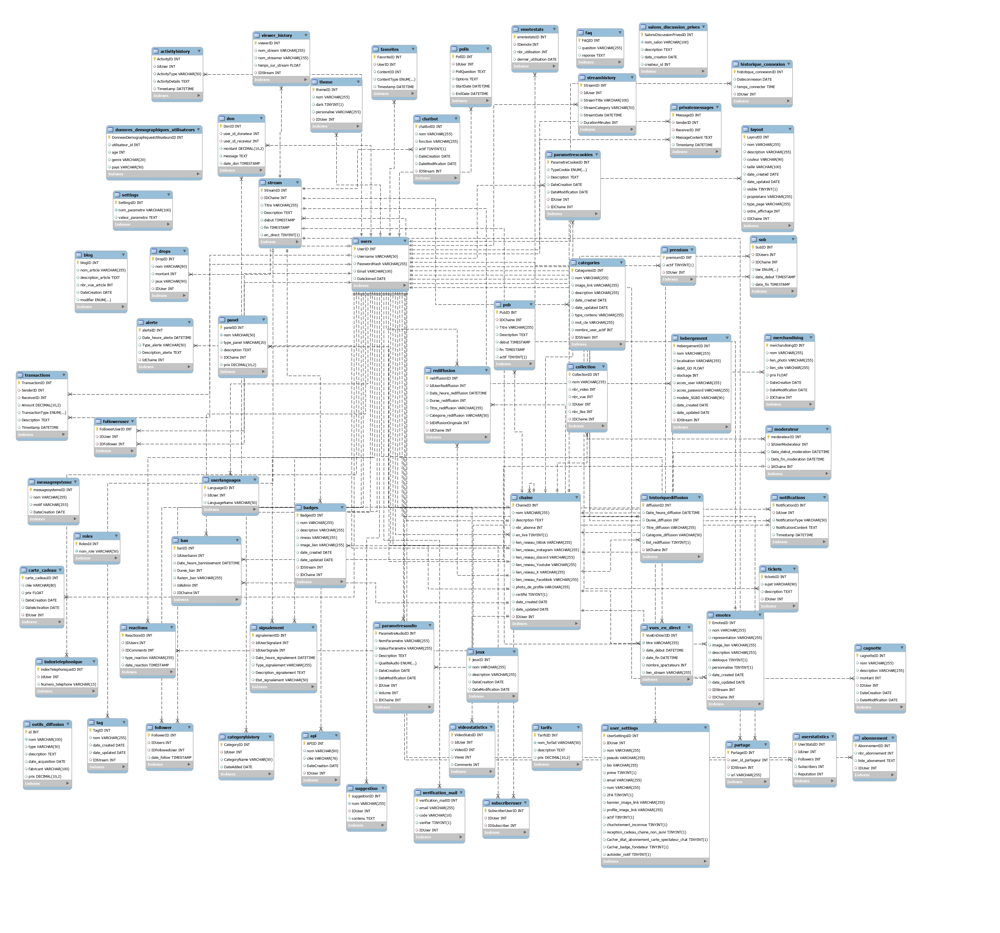

# Projet Twatch

Ce dépôt GitHub contient les documents et le code source associés au projet de base de données semblable celle de [Twitch](https://www.twitch.tv).

## Initialisation du Projet

Si vous possédez déjà une base de données appelée 'twitch', remplacez les premières lignes du code de Global.sql par :


```sql
CREATE DATABASE projet_nom_1;
USE DATABASE projet_nom_1;
```

Ainsi que celle de Full_insert_script.sql et requêtes.sql par : 

```sql
USE twitch;
```

De plus si vous possedez deja un utilisateurs s'apellant Allan il vous faudrat modifier les lignes suivantes dans le fichier new-user.sql

```sql
CREATE USER 'votre_nom'@'localhost' IDENTIFIED WITH mysql_native_password BY 'votre_mot_de_passe';
```

# Modèle de Données

Ce projet repose sur un modèle de données qui se divise en deux parties principales : le Modèle Conceptuel de Données (MCD) et le Modèle Logique de Données (MLD).

## Modèle Conceptuel de Données (MCD)



Le MCD représente les entités et leurs relations de manière abstraite, offrant une vue globale de la structure de la base de données.

## Modèle Logique de Données (MLD)


Le MLD traduit le MCD en un schéma relationnel précis, définissant les tables, les clés primaires, les clés étrangères et les contraintes.


# Crédits

Le projet a pu être mené à bien grâce à la participation de :

## Contributeurs

- [Hugo Galley](https://github.com/Hugo-Galley)
- [Christophe Jarjoura](https://github.com/DysterFall)
- [Justine Guy](https://github.com/ekyoko)
- Benmoussa Maïssa
- Aziz

## Remerciements spéciaux

- [Alan Busi](https://github.com/AllanBUSI) - Pour ses conseils et ses ressources.


